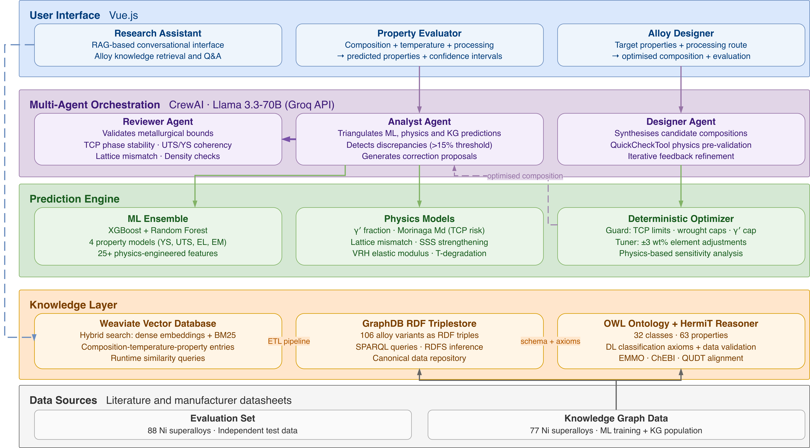

<div align="center">

# 🔬 AlloyGraph

### A Multi-Agent AI Platform for Nickel-Based Superalloy Property Prediction, Inverse Design, and Knowledge-Driven Research

[](https://www.python.org/downloads/)
[](https://docs.docker.com/compose/)

[🌐 Live Demo](http://alloygraph.ddnsfree.com:3000) · [📐 Ontology](https://w3id.org/alloygraph/ont) · [📦 Data (figshare)](https://doi.org/10.6084/m9.figshare.31860466)



*Five-layer architecture: user interface, multi-agent orchestration, prediction engine, knowledge layer, and data sources.*

</div>

---

## 📖 Overview

AlloyGraph is an open-source platform that predicts mechanical properties of nickel-based superalloys, designs new alloy compositions, and answers natural language questions about superalloy data. It integrates three complementary approaches:

| Component | Description |
|-----------|-------------|
| 🧠 **Knowledge Graph** | 77 experimentally characterised alloys in GraphDB (RDF) + Weaviate (vector search), structured by an OWL 2 DL ontology with HermiT reasoning |
| ⚙️ **Physics-Informed ML** | XGBoost + Random Forest ensemble trained on 50–80 physics-based features (Morinaga Md, lattice mismatch, SSS strengthening) |
| 🤖 **Multi-Agent LLM** | Analyst and Reviewer agents (Llama 3.3-70B via CrewAI) triangulating ML, physics, and KG experimental data |

---

## 🎯 Three Operational Modes

| Mode | Input | Output | Accuracy |
|------|-------|--------|----------|
| 💬 **Research Assistant** | Natural language question | Grounded answer with citations | 91.2% on 250 factual questions |
| 📊 **Property Evaluator** | Composition + temperature | YS, UTS, EL, EM predictions | MAE: 80.6 MPa (YS), 95.2 MPa (UTS) |
| 🧪 **Alloy Designer** | Target properties | Optimised composition | 72% of targets met, 0 Critical TCP |

---

## 📈 Key Results

Evaluated on **88 independent alloys** from manufacturer datasheets (Special Metals, Haynes International, ATI) and a held-out subset of the Nickel Institute handbook:

| Property | Full System | ML-only | GPT-4.1-mini FT | Improvement |
|----------|:-----------:|:-------:|:----------------:|:-----------:|
| Yield Strength (MPa) | **80.6** | 102.0 | 100.3 | 21% |
| UTS (MPa) | **95.2** | 114.0 | 110.8 | 16% |
| Elongation (%) | 13.1 | 14.2 | **13.8** | 8% |
| Elastic Modulus (GPa) | 9.0 | 13.3 | **8.2** | 32% |

> The full system outperforms all baselines on strength properties. The fine-tuned GPT-4.1-mini (trained on identical data) is competitive on elongation and elastic modulus, suggesting complementary strengths.

---

## 🧱 Components at a Glance

| Component | Description | Location |
|-----------|-------------|----------|
| 🖥️ **Web Interface** | Vue.js app with Chat, Evaluate, and Design modes | [`frontend/`](frontend/) |
| 🐍 **Backend API** | Flask + Gunicorn REST API serving all three modes | [`backend/app.py`](backend/app.py) |
| 🤖 **Agent Pipeline** | Analyst → Reviewer sequential pipeline via CrewAI | [`backend/alloy_crew/`](backend/alloy_crew/) |
| 📐 **OWL Ontology** | 32 classes · 17 object properties · 46 data properties | [`ontology/`](ontology/) |
| 🔍 **Vector Search** | Weaviate hybrid search (dense embeddings + BM25) | [`backend/pipeline/`](backend/pipeline/) |
| 📊 **RDF Triplestore** | GraphDB with SPARQL queries and RDFS inference | [`backend/pipeline/`](backend/pipeline/) |
| 🧬 **ML Models** | XGBoost + Random Forest ensemble (4 property models) | [`backend/alloy_crew/models/`](backend/alloy_crew/models/) |
| ⚗️ **Physics Engine** | Morinaga Md, lattice mismatch, SSS, GP fraction | [`backend/alloy_crew/config/`](backend/alloy_crew/config/) |
| 🔧 **Optimizer** | Deterministic Guard + Tuner (±3 wt% max, 0.5 wt% steps) | [`backend/alloy_crew/deterministic_optimizer.py`](backend/alloy_crew/deterministic_optimizer.py) |
| 📏 **Evaluation** | 88-alloy benchmark + 250 MCQ + 20 design targets | [`evaluation/`](evaluation/) |

---

## 🚀 Quick Start

### Prerequisites
- [Docker](https://docs.docker.com/get-docker/) and Docker Compose
- [Groq API key](https://groq.com) (free tier available) or any OpenAI-compatible endpoint

### Setup

```bash
# 1. Clone
git clone https://github.com/AlexLecu/AlloyGraph.git
cd AlloyGraph

# 2. Configure
cp .env.example .env
# Edit .env and add your GROQ_API_KEY

# 3. Launch
docker compose up -d

# 4. Open http://localhost:3000
```

> 💡 The pipeline service automatically builds the ontology, populates GraphDB, and ingests data into Weaviate on first run (~2–3 minutes).

For detailed Docker configuration, see [📄 README_DOCKER.md](README_DOCKER.md).

---

## 🗂️ Project Structure

```
AlloyGraph/
├── backend/                    # Flask API + AI pipeline
│   ├── alloy_crew/            # Multi-agent system
│   │   ├── config/            # Physics constants, thresholds, bounds
│   │   ├── models/            # ML models and training data
│   │   └── tools/             # Agent tools (analysis, KG search, verification)
│   ├── pipeline/              # Data ingestion pipeline
│   │   ├── build_ontology.py  # OWL ontology builder (owlready2 + HermiT)
│   │   ├── enrich_graphdb.py  # RDF triple generation + GraphDB upload
│   │   ├── weaviate_schema.py # Weaviate collection definitions
│   │   └── weaviate_ingest.py # GraphDB → Weaviate ETL
│   └── services/              # Chat and evaluation services
├── frontend/                   # Vue.js web interface
├── ontology/                   # Published OWL ontology
│   └── alloygraph.owl         # OWL 2 DL with HermiT classification axioms
├── evaluation/                 # Evaluation scripts and results
│   ├── prediction/            # Property prediction (88 alloys, 3 classes)
│   ├── chatbot/               # MCQ, RAGAS, and expert evaluation
│   └── design/                # Inverse design (20 targets)
├── docker-compose.yml          # Full platform deployment
```

---

## 📐 Ontology

The AlloyGraph ontology (v1.2.0) formalises nickel-based superalloys as an OWL 2 DL knowledge model:

- 🏗️ **32 classes** organised around materials, phases, properties, and metadata
- 🔄 **Classification axioms** — automatic alloy type (SSS / γ') and TCP risk level via HermiT
- ✅ **Data validation** — physical plausibility bounds checked at ingestion
- 🔗 **Interoperable** — aligned to EMMO, ChEBI, and QUDT via `skos:closeMatch`

Registered at [w3id.org/alloygraph/ont](https://w3id.org/alloygraph/ont) under CC-BY 4.0.

---

## 🧪 Evaluation Summary

### 📊 Property Prediction
- 88 alloys across 3 classes (precipitation hardened, solid solution, SC/DS)
- 6 configurations compared (ML, ML+Physics, Full System, LLM-only, GPT-4.1-mini, GPT-4.1-mini FT)
- Wilcoxon signed-rank tests confirm significance (p < 0.001 for YS, UTS, and EM; p = 0.038 for EL)

### 💬 Research Assistant
- **250 MCQ**: 91.2% accuracy (vs ~50% for vanilla LLMs)
- **100 open-ended questions**: evaluated with RAGAS (relevancy: 0.95, faithfulness: 0.74)
- **12 expert-graded questions**: domain expert validation on university-level metallurgy

### 🔧 Inverse Design
- 20 target specifications across wrought and cast processing
- 72% of property targets met within 90% threshold
- Zero Critical TCP risk violations; domain expert validated metallurgical soundness

---

## 📦 Data

All data used in this project is publicly available. The complete archive (KG data, evaluation sets, ontology, and trained models) is hosted on [figshare](https://doi.org/10.6084/m9.figshare.31860466).

| Resource | Description | Link |
|----------|-------------|------|
| 🗃️ **Knowledge Graph data** | 77 alloys with compositions, properties, and metadata | Included in archive |
| 📏 **Evaluation set** | 88 alloys from manufacturer datasheets and Nickel Institute handbook holdout | Included in [`evaluation/`](evaluation/) |
| 📚 **Source data** | Nickel Institute High-Temperature High-Strength Ni-Base Alloys | [nickelinstitute.org](https://nickelinstitute.org/en/technical-resources/high-temperature-alloys/) |

---

## 🛠️ Technologies

| Category | Stack |
|----------|-------|
| 🐍 Backend | Python, Flask, CrewAI, XGBoost, scikit-learn, owlready2, rdflib |
| 🖥️ Frontend | Vue.js, Nginx |
| 🗄️ Databases | Weaviate 1.33, GraphDB 10.8 |
| 🤖 LLM | Llama 3.3-70B (Groq API or Ollama for local deployment) |
| 📐 Ontology | OWL 2 DL, HermiT reasoner, Protégé |

---

## ✅ FAIR Principles Compliance

- **Findable**: Published on GitHub with persistent DOI via [figshare](https://doi.org/10.6084/m9.figshare.31860466). Ontology registered at [w3id.org/alloygraph/ont](https://w3id.org/alloygraph/ont).
- **Accessible**: All code, data, and ontology are openly available. Docker Compose deployment requires no proprietary software.
- **Interoperable**: Standards-aligned ontology (see [Ontology](#-ontology) section). RDF triples in GraphDB; standard SPARQL access.
- **Reusable**: Modular pipeline (ontology builder, KG ingestion, ML training, agent evaluation) with documented configuration and reproducible Docker setup.
